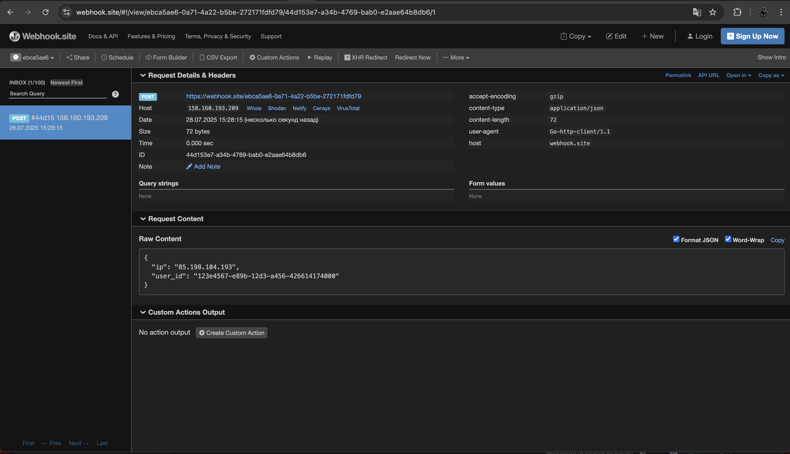

# Auth Service

## Описание

Auth Service — это микросервис аутентификации, реализованный на Go с использованием PostgreSQL и Docker. Он предоставляет API для генерации, обновления и проверки токенов, а также деавторизации пользователей.

Проект выполнен в рамках тестового задания на позицию **Junior Backend Developer**.

---

## Технологии

- Go
- PostgreSQL
- Docker / Docker Compose
- Swagger
- JWT (SHA512)
- bcrypt

---

## Сборка

Убедитесь, что у вас установлен Docker и Docker Compose.

1. Клонируйте репозиторий:
```bash
git clone https://github.com/Tommych123/auth-service.git
cd auth-service
```
2. Создайте в корне проекта(папке auth-service) файл .env, по примеру .env-example:

```env
DB_HOST=db
DB_PORT=5432
DB_USER=pavelmiltsev
DB_PASSWORD=12345
DB_NAME=authdb
JWT_SECRET=5110dfc6e34b107f24889c0a94205c50b3be9b69b2954aae00538c58042112d7646ba96062eb0de856a5db72b8c9c4acba651c19c3cf555f9bc7a665d5671f7f
PORT=8080
WEBHOOK_URL=https://webhook.site/ebca5ae6-0a71-4a22-b5be-272171fdfd79
```

3. Запустите сервис:
```bash
docker-compose -f docker-compose.yml up -d
```

По умолчанию приложение запускается на порту `8080`.

---

## API эндпоинты

Полная документация доступна по адресу:
```
http://localhost:8080/swagger/index.html
```
(localhost если вы запускаете и swagger и сервер на одной машине, в случае если вы запускаете на разных машинах вам необходимо вместо localhost поставить публичный IP той с которой запущен сервер(например http://158.160.193.209:8080/swagger/index.html где публичный IP - 158.160.193.209))

### 1. POST `/token?user_id=<UUID>`

Получение пары токенов.

- **Query:** `user_id` — обязательный GUID пользователя.
- **Response:** `access_token`, `refresh_token`
- **Errors:** `400` (отсутствует user_id), `500` (ошибка генерации токенов)

---

### 2. POST `/refresh`

Обновление пары токенов.

- **Body (JSON):**
```json
{
  "refresh_token": "<string>",
  "user_id": "<UUID>"
}
```

- **Response:** новая пара токенов.
- **Errors:**
  - `400` — неверный формат запроса
  - `401` — невалидный refresh токен, попытка использовать старый, изменение User-Agent

---

### 3. GET `/me`

Получение `user_id` из access токена.

- **Headers:** `Authorization: Bearer <access_token>`
- **Response:** `user_id`
- **Errors:** `401` — невалидный или отсутствующий токен

---

### 4. POST `/logout`

Деавторизация пользователя. После выполнения токен становится недействительным.

- **Headers:** `Authorization: Bearer <access_token>`
- **Response:** `200 OK` — успешный выход
- **Errors:** `401`, `500`

---

## Функциональные требования

### Access токен:
- Формат: JWT
- Алгоритм: SHA512
- Не хранится в БД

### Refresh токен:
- Произвольный base64 токен
- Хранится в виде bcrypt-хеша
- Одноразовый (replay protection)
- Защита от подмены

### Ограничения:
- Refresh запрещён при изменении User-Agent (при этом сессия инвалидация)
- При попытке refresh с нового IP — отправляется webhook POST-запрос (операция разрешена)

---

## Конфигурация

Файл `.env` содержит переменные окружения:

```
PORT=8080
DB_HOST=db
DB_PORT=5432
DB_USER=pavelmiltsev
DB_PASSWORD=12345
DB_NAME=authdb
JWT_SECRET=your-secret
WEBHOOK_URL=http://your-webhook.url/endpoint
```

---

## Структура проекта

```
.
├── cmd/                # Точка входа (main.go)
├── internal/
│   ├── auth/           # Логика токенов, обработчики, сервис
│   ├── db/             # Работа с PostgreSQL
│   └── config/         # Конфигурация из .env
├── scripts/            # SQL миграции
├── Dockerfile
├── docker-compose.yml
└── .env
```

---

## Webhook

Webhook вызывается на указанный URL при попытке обновить токены с нового IP:

```json
{
  "user_id": "123e4567-e89b-12d3-a456-426614174000",
  "ip": "192.168.1.123",
  "user_agent": "curl/7.68.0"
}
```
Скриншот примера обработки:


---